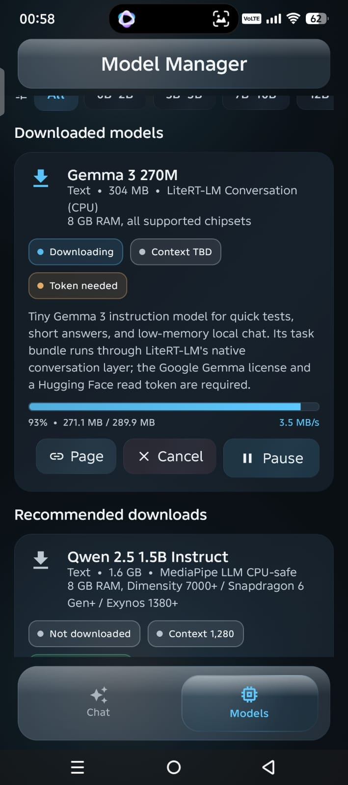

<div align="center">


# Solus

### Private, local AI — running entirely on your Android device.

Chat, reason, code, and analyze documents offline with complete privacy.  
Your conversations never leave your phone.

<br/>

<p>
  <a href="https://github.com/ShounakPatra/Solus/releases/latest">
    
  </a>
</p>

<p>
  <a href="https://github.com/ShounakPatra/Solus/releases/latest">
    
  </a>
  
  
  
</p>

<p>
  
  
  
  
  
</p>

**🔒 100% Offline &nbsp;•&nbsp; 💳 No Subscriptions &nbsp;•&nbsp; 🚀 On-Device Speed &nbsp;•&nbsp; ✨ Glass UI**

</div>

---

## 📱 App Preview

<p align="center">
  
  &nbsp;&nbsp;
  
  &nbsp;&nbsp;
  
</p>

<p align="center">
  <sub><b>Private chat</b> · <b>Model manager</b> · <b>Resumable downloads</b></sub>
</p>

---

## ✨ Features

| | Capability |
|---|---|
| 💬 | **Local multi-turn chat** — inference on-device via CPU / GPU |
| 🧠 | **Thinking mode** — full control for reasoning models (e.g. DeepSeek R1-style) |
| 🖼️ | **Vision & documents** — images, camera, files, and rich document chat |
| 📐 | **Math rendering** — native LaTeX, scrollable formulas, copy & selection |
| ⏬ | **Resumable downloads** — pause, resume, speed, progress, crash recovery |
| 📱 | **Device-aware guidance** — RAM, chipset, and compatibility-aware model picks |
| ✨ | **Glassmorphism UI** — Compose + Haze blur, fluid tab & FAB motion |
| 📚 | **History that just works** — open past chats even before a model is ready |

---

## 🆕 What’s new in **v1.2.0**

- **Directional tab transitions** — Chat ↔ Models share a smooth mirrored slide + fade
- **Real blur on scroll FABs** — circular Haze glass buttons over the message list
- **Smarter FAB docking** — top FAB eases into the bottom dock when you’re at the end of chat; bottom FAB keeps its corner seat at the top of chat
- **Deferred history load** — pick a chat with no model initialised; messages load, Share works, session commits when a model is ready
- **History always visible** — message list is prioritised so past chats are never hidden behind empty “no model” states

---

## 🛠️ Built With

| Layer | Stack |
|---|---|
| Language | **Kotlin** |
| UI | **Jetpack Compose**, Material 3, Haze glass blur |
| Inference | **LiteRT** (TensorFlow Lite), **MediaPipe GenAI** |
| Math | `com.hrm.latex` |
| Local state | **SharedPreferences** (chat history, settings, download state) |

---

## 📊 Solus vs Google AI Edge Gallery

Both run generative AI on-device. Solus focuses on a polished private Android assistant with documents, guided models, and reliable downloads.

| Feature | Solus | Google AI Edge Gallery |
|---|:---:|:---:|
| Fully offline inference | ✅ | ✅ |
| Open source | ✅ | ✅ |
| Free | ✅ | ✅ |
| Local conversation history | ✅ | ✅ |
| Vision models | ✅ | ✅ |
| Document chat (PDF, DOCX, PPTX, XLSX, …) | ✅ | ❌ |
| Multiple model families | ✅ | ✅ |
| Thinking mode | ✅ | ✅ |
| Download manager with resume | ✅ | ✅ |
| Device-aware model recommendations | ✅ | ❌ |
| Response cleanup (control tokens / thinking tags) | ✅ | ❌ |
| Deferred history when no model is ready | ✅ | ❌ |

---

## 🎯 Model Compatibility Guide

| Need | Starting point | Size | Gated |
|---|---|:---:|:---:|
| Everyday chat & summaries | Qwen 2.5 Instruct / Gemma 3 | ~1.5–3 GB | No / Yes |
| Kotlin, Python, coding | Qwen 2.5 Coder | ~2.2 GB | No |
| Math, planning, reasoning | DeepSeek R1 Distill / Qwen 3 | ~1.8 GB | No |
| Images & visual Q&A | Gemma 3n Vision / FastVLM | ~2.5 GB | Yes |
| Low RAM / quick test | Qwen 2.5 0.5B / TinyLlama | ~400 MB | No |

> Tip: use the **Models** tab filters and device cards — Solus highlights what fits your phone.

---

## 📂 Project Structure

```text
Solus
├── app/
│   ├── src/main/java/com/shounak/localmeshai/
│   │   ├── ai/                 # Inference managers & runtimes
│   │   ├── ui/
│   │   │   ├── components/     # Math cards, bubbles, shared UI
│   │   │   ├── screens/        # Chat, Models, Image / vision flows
│   │   │   ├── theme/          # Colors, typography, glass theme
│   │   │   └── viewmodels/     # Chat, Vision, Main
│   │   ├── utils/              # Glass effects, sanitizers, downloads
│   │   └── MainActivity.kt
│   └── build.gradle.kts
├── docs/screenshots/
├── gradle/libs.versions.toml
└── README.md
```

---

## 📥 Installation

1. Open **[Releases](https://github.com/ShounakPatra/Solus/releases)** (or the big download badge above).
2. Download the latest **`release.apk`** for **v1.2.0**.
3. Install on your phone (allow *Install unknown apps* if prompted).
4. Open Solus → **Models** → download a compatible model → start chatting.

**Requirements:** Android **8.0+** (API 26), **ARM64** device recommended for on-device models.

---

## 🏗️ Build from Source

**Requirements:** Android Studio (Ladybug or newer) · Android SDK **36** · **JDK 17**

```bash
git clone https://github.com/ShounakPatra/Solus.git
cd Solus

# Debug APK
./gradlew assembleDebug

# Unit tests
./gradlew testDebugUnitTest
```

Debug APK path: `app/build/outputs/apk/debug/app-debug.apk`

---

## 🔐 Privacy by Design

- Inference runs **only on-device** (CPU / GPU) after models are downloaded.
- Chat history stays in **local app storage** (not a cloud backend).
- Network access is for **model downloads** and optional links — not for chatting.
- Hugging Face tokens (for gated models) are stored **only on the device**.

---

## 💡 FAQ

<details>
<summary><b>Does Solus run fully offline?</b></summary>
<br/>

Yes. After a model is downloaded you can turn off Wi‑Fi and mobile data. Chat and history stay local.

</details>

<details>
<summary><b>Why is the APK relatively large (~200MB)?</b></summary>
<br/>

Native runtimes (MediaPipe, LiteRT) and architecture-specific libraries ship in the APK so inference is fast out of the box.

</details>

<details>
<summary><b>Can I load arbitrary GGUF / ONNX files?</b></summary>
<br/>

Not yet. Current runtimes need Android-ready formats such as <code>.task</code> or <code>.litertlm</code> with the right tokenizer setup.

</details>

<details>
<summary><b>I opened history without a model — is that expected?</b></summary>
<br/>

Yes in <b>v1.2.0</b>. Messages load immediately; initialise a chat model to continue generating.

</details>

---

## 🗺️ Roadmap

| Version | Status | Highlights |
|---|:---:|---|
| **v1.0.0** | ✅ Shipped | Core local chat, model manager, glass UI foundation |
| **v1.1.0** | ✅ Shipped | Thinking controls, resumable downloads, device checks, UI polish, tests |
| **v1.1.1** | ✅ Shipped | LaTeX □ placeholders, math render hardening, layout polish |
| **v1.2.0** | ✅ **Current** | Tab motion, Haze scroll FABs, FAB docking, deferred history load |
| **v1.3.0** | 🔜 Next | Download integrity checksums, stronger model validation UX, accessibility pass |
| **v2.0.0** | 🔬 Research | On-device speech (Whisper-class), local conversion helpers, benchmarks, encrypted exports |

---

## 👤 Author

**Shounak Patra**  
GitHub: [@ShounakPatra](https://github.com/ShounakPatra)

---

## 📄 License

Solus is licensed under the **Apache License 2.0**. See [LICENSE](LICENSE) for details.

---

<div align="center">

**Made for private, on-device AI.**  
[⬇ Download v1.2.0](https://github.com/ShounakPatra/Solus/releases/latest) · [★ Star on GitHub](https://github.com/ShounakPatra/Solus)

</div>
