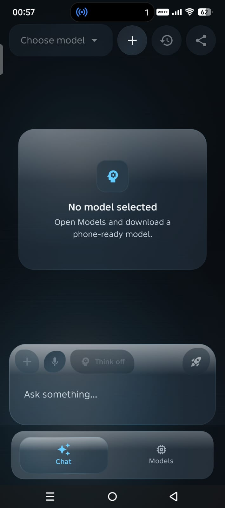

<div align="center">


# Solus

### Private, local AI running entirely on your Android device.

Chat, reason, code, and explore documents with local language models. Once a model is downloaded, your prompts, documents, and generated responses stay 100% on your phone.

<p>
  <a href="https://github.com/ShounakPatra/Solus/releases/download/v1.1.0/release.apk">
    
  </a>
</p>

<p>
  
  
  
  
  
  
</p>

**🔒 No cloud inference. 💳 No subscriptions. 📡 Works entirely offline.**

</div>

---

## 📱 App Preview

<p align="center">
  
  
</p>
<p align="center">
  <sub><b>Private Local Chat</b> (Left) &bull; <b>Guided Model Management</b> (Right)</sub>
</p>

---

## ✨ Features & Highlights

*   **💬 Local Multi-turn AI Chat:** Powered directly by your Android device's hardware.
*   **🧠 Advanced Reasoning (Thinking Mode):** Toggle thinking mode control for reasoning-optimized models (like DeepSeek R1).
*   **🖼️ Multimodal Vision Support:** Ask questions about images, photos, and camera inputs using compatible vision-language models.
*   **📐 Math & Formula Rendering:** Beautiful, native LaTeX rendering with horizontal scroll containers, copy actions, and text selection support.
*   **📄 Deep Document Analysis:** Analyze local text, Markdown, code files, and documents directly inside your chats.
*   **⏬ Resumable Downloads:** Storage-friendly download manager featuring download speed, progress indicators, pause/resume, and crash recovery.
*   **📐 Device-Aware Model Guidance:** RAM, chipset, runtime, and compatibility flags help you pick the perfect model for your phone.
*   **✨ Premium Glassmorphic UI:** A responsive, modern user interface built using Jetpack Compose and Haze blur effects.

---

## Why Solus?

Most AI assistants send every message to a remote server. Solus brings the model to your phone instead. Choose a compatible model, download it once, and continue chatting without sending your conversations to an AI API.

|                       | Experience                                                                                      |
| --------------------- | ----------------------------------------------------------------------------------------------- |
| **Private by design** | Prompts, chat history, and generation remain on-device.                                         |
| **Works offline**     | After the selected model is downloaded, inference does not need an internet connection.         |
| **Choose your model** | Pick from compact chat, coding, reasoning, and vision-capable model options.                    |
| **Explore documents** | Ask questions about documents, spreadsheets, presentations, source code, and other local files. |
| **Built for Android** | Device-aware model guidance helps you choose an option that fits your phone.                    |

> Solus uses the internet to download model files. Some gated models also require accepting their licence and supplying a Hugging Face read token.

---

## Highlights

* **Local AI chat** powered directly by your Android device
* **Multiple model families**, including Qwen, Gemma, Llama, Phi, DeepSeek, TinyLlama, and FastVLM
* **Thinking-mode control** for compatible reasoning models
* **Image questions** with supported vision-language models
* **Document analysis** for PDF, DOCX, PPTX, XLSX, ODT, HTML, RTF, Markdown, source code, and more
* **Resumable model downloads** with progress, speed, storage, and recovery states
* **Conversation history**, response sharing, and generation-speed feedback
* **Clean output handling** that removes model control tokens and malformed thinking tags
* **Glass-inspired Jetpack Compose UI** with light and dark theme support

---

## Supported Model Families

<div align="center">

<p>
  
  
  
  
</p>

<p>
  
  
  
</p>

</div>

Model availability depends on whether a compatible Android-ready artifact exists. Some listed models may require conversion before they can run through the supported on-device runtimes.

---

## 📊 Solus vs Google AI Edge Gallery

Both projects provide open-source tools for running generative AI directly on mobile hardware. Solus is designed as a focused private Android assistant with document support, guided model selection, and reliable model management.

| Feature | Solus | Google AI Edge Gallery |
|---|:---:|:---:|
| **Fully offline inference** | ✅ | ✅ |
| **Open source** | ✅ | ✅ |
| **Free** | ✅ | ✅ |
| **Local conversation history** | ✅ | ✅ |
| **Vision models** | ✅ | ✅ |
| **Document chat for PDF, DOCX, PPTX, XLSX, and other formats** | ✅ | ❌ |
| **Multiple model families** | ✅ | ✅ |
| **Thinking mode** | ✅ | ✅ |
| **Download manager with resume support** | ✅ | ✅ |
| **Device-aware model recommendations** | ✅ | ❌ |
| **Response cleanup for control tokens and malformed thinking tags** | ✅ | ❌ |

### Why Choose Solus?

Choose **Solus** when you want:
* A private AI assistant rather than an experimentation-focused showcase
* Local document chat across PDFs, Word files, presentations, spreadsheets, code, and other formats
* Device-aware recommendations based on your phone and available resources
* Resumable model downloads with progress and recovery support
* Clean model output without exposed control tokens or malformed thinking tags
* Support for chat, coding, reasoning, and vision model families
* Compatibility with Android 8.0 and newer
* A focused Android interface for daily local AI use

> This comparison covers built-in user-facing features. Both projects are under active development, so capabilities may change in future releases.
>
> Solus is an independent open-source project and is not affiliated with, endorsed by, or sponsored by Google.

---

## From Download to Private Chat

|  Step | What happens |
| :---: | ------------------------------------------------------------------------------------------------------ |
| **1** | Install Solus from the GitHub Releases page. |
| **2** | Open **Models** and choose a model suited to your device. |
| **3** | Review its size, requirements, runtime, context window, and compatibility guidance. |
| **4** | Download the model once. Public models need no account; gated models may require a Hugging Face token. |
| **5** | Start chatting. Inference and conversation history remain on your phone. |

<p align="center">
  
  
</p>
<p align="center">
  <sub>Start with clear setup guidance, then monitor and control large model downloads directly in the app.</sub>
</p>

---

## 🎯 Model Compatibility Guide

Select the model that best fits your storage, memory capacity, and target task:

| Need | Recommended Starting Point | Size | Gated |
|---|---|:---:|:---:|
| **Everyday conversation & summarization** | Qwen 2.5 Instruct / Gemma 3 | ~1.5 - 3 GB | No / Yes |
| **Kotlin, Python, and coding help** | Qwen 2.5 Coder | ~2.2 GB | No |
| **Math, planning & deep reasoning** | DeepSeek R1 Distill or Qwen 3 | ~1.8 GB | No |
| **Image description & visual search** | Gemma 3n Vision or FastVLM | ~2.5 GB | Yes |
| **Limited RAM / Storage testing** | Qwen 2.5 0.5B / TinyLlama | ~400 MB | No |

Model availability and performance depend on the Android-ready artifact, available storage, RAM, chipset, selected runtime, context length, and prompt. Solus identifies models that require conversion or are not currently ready for direct on-device use.

---

## 📂 Project Structure

```text
Solus
├── app
│   ├── src
│   │   ├── main
│   │   │   ├── java/com/shounak/localmeshai
│   │   │   │   ├── ai/            # Model inference, session management, and parsing
│   │   │   │   ├── ui/            # Jetpack Compose UI (screens, themes, components)
│   │   │   │   │   ├── components/# Reusable elements (bubbles, math cards)
│   │   │   │   │   ├── screens/   # Primary views (Chat, Models, ImageGen)
│   │   │   │   │   └── theme/     # Glassmorphic themes and color palettes
│   │   │   │   └── utils/         # Markdown, LaTeX parser, math normalizers, glass shaders
│   │   │   └── res/               # Layouts, drawables, XML assets
│   │   └── test/                  # Unit and integration test suites
│   └── build.gradle.kts
└── gradle/                        # Dependency version catalog (libs.versions.toml)
```

Third-party models remain subject to the licences and acceptable-use requirements established by their respective publishers.

---

## 📥 Installation

1. Go to the [Solus Releases](https://github.com/ShounakPatra/Solus/releases) page.
2. Download the latest `release.apk`.
3. Open the APK file on your device. (Enable "Install unknown apps" from settings if prompted).
4. Run the app, head over to the **Models** tab, and select a compatible model to download.

*Requires **Android 8.0 (API 26) or newer** and a compatible ARM64 processor.*

---

## 🏗️ Build from Source

### Requirements
- Android Studio Ladybug (or newer)
- Android SDK 36
- JDK 17

```bash
# Clone the repository
git clone https://github.com/ShounakPatra/Solus.git
cd Solus

# Compile the debug APK
./gradlew assembleDebug

# Run unit tests
./gradlew testDebugUnitTest
```

The debug APK will be generated at `app/build/outputs/apk/debug/app-debug.apk`.

---

## 🔐 Privacy by Design

Solus is built from the ground up to respect user privacy:
- All LLM and vision inference takes place locally on your GPU/CPU.
- Prompt history is stored securely in SQLite database files inside local app storage.
- Internet permissions are used *exclusively* for model file downloads and external hyperlinks.
- Hugging Face API keys/tokens are only stored locally on your device (used for gated downloads).

Please report security issues privately via our [Security Policy](SECURITY.md).

---

## 💡 FAQ

<details>
<summary><b>Does Solus run entirely offline?</b></summary>
<p>Yes. Once a model is downloaded, you can disable Wi-Fi/cellular data entirely. Inference and chat history are processed locally without making network calls.</p>
</details>

<details>
<summary><b>Why is the initial APK download around 200MB?</b></summary>
<p>The APK bundles multiple heavy native runtimes (MediaPipe, LiteRT) and native C++ libraries for various CPU/GPU architectures to make on-device inference as fast as possible.</p>
</details>

<details>
<summary><b>Can I import my own custom GGUF or ONNX model files?</b></summary>
<p>Not directly. The current runtimes require models converted to a verified Android-compatible format (like <code>.task</code> or <code>.litertlm</code>) containing the correct tokenizer configurations.</p>
</details>

---

## 🗺️ Roadmap

- [x] **v1.1.0 Releases:** Reliable thinking controls, resumable downloads, device hardware checks, glassmorphic UI polish, and unit testing coverage.
- [ ] **v1.2.0 (Next):** Download integrity checksums, cleaner model validation feedback, accessibility improvements, and setup documentation.
- [ ] **v2.0.0 (Researching):** On-device speech recognition (whisper pipelines), local model conversions, custom benchmarks, and encrypted chat exports.

---

## 🤝 Contributing

We welcome bug reports, model conversion suggestions, and code updates.
- Please read [CONTRIBUTING.md](CONTRIBUTING.md) before submitting a pull request.
- Follow our [Code of Conduct](CODE_OF_CONDUCT.md) inside comments and issues.

---

## 👤 Author

**Shounak Patra**
* GitHub: [@ShounakPatra](https://github.com/ShounakPatra)

---

## 📄 License

Solus is licensed under the Apache License 2.0. See the [LICENSE](LICENSE) file for details.
