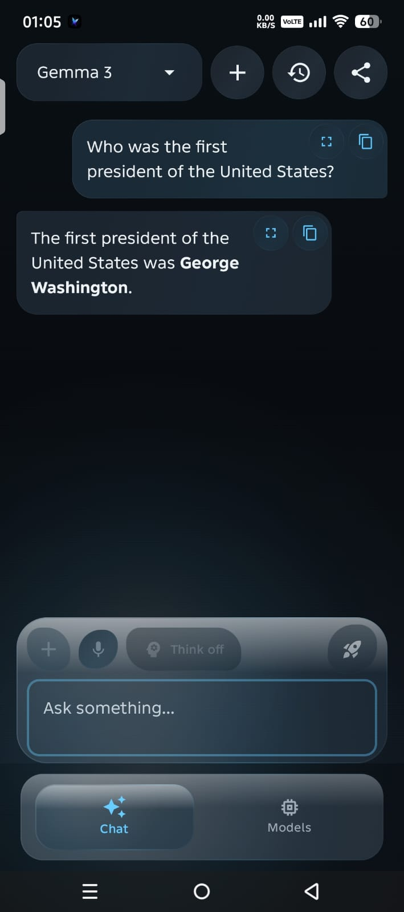
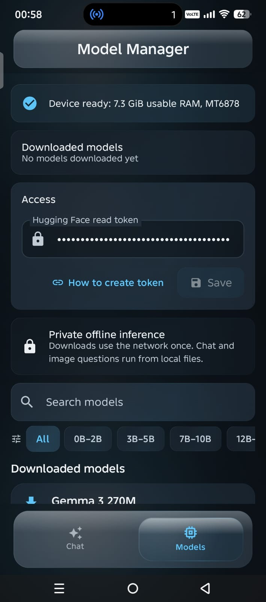

<div align="center">


# Solus

### Private, local AI running entirely on your Android device.

Chat, reason, code, and analyze documents offline with complete privacy. Your conversations never leave your device.

<p>
  <a href="https://github.com/ShounakPatra/Solus/releases/latest">
    
  </a>
</p>

<p>
  
  
  
  
  
</p>

**🔒 100% Offline • 💳 No Subscriptions • 🚀 Device-Native Speed**

</div>

---

## 📱 App Preview

<p align="center">
  
  
</p>
<p align="center">
  <sub><b>Private Local Chat</b> (Left) &bull; <b>Guided Model Management</b> (Right)</sub>
</p>

---

## ✨ Features & Highlights

*   **💬 Local Multi-turn AI Chat:** Powered directly by your Android device's CPU and GPU.
*   **🧠 Advanced Reasoning (Thinking Mode):** Full thinking mode control for reasoning-optimized models like DeepSeek R1.
*   **🖼️ Multimodal Vision Support:** Ask questions about images, photos, and camera inputs using vision-language models.
*   **📐 Math & Formula Rendering:** Beautiful, native LaTeX rendering with horizontal scroll containers, copy actions, and text selection support.
*   **📄 Deep Document Analysis:** Analyze local text, Markdown, code files, and documents directly inside your chats.
*   **⏬ Resumable Downloads:** Storage-friendly download manager featuring download speed, progress indicators, pause/resume, and crash recovery.
*   **📐 Device-Aware Model Guidance:** RAM, chipset, runtime, and compatibility flags help you pick the perfect model for your phone.
*   **✨ Premium Glassmorphism UI:** A responsive, modern user interface built using Jetpack Compose.

---

## 🛠️ Built With

- **Language:** Kotlin
- **UI Toolkit:** Jetpack Compose (Modern Glassmorphic design)
- **Local Inference:** LiteRT (TensorFlow Lite), MediaPipe GenAI SDK
- **LaTeX Math Rendering:** `com.hrm.latex`
- **Data Persistence:** Room (SQLite)

---

## 📊 Solus vs Google AI Edge Gallery

Both projects provide open-source tools for running generative AI directly on mobile hardware. Solus is designed as a focused private Android assistant with document support, guided model selection, and reliable model management.

| Feature | Solus | Google AI Edge Gallery |
|---|:---:|:---:|
| **Fully offline inference** | ✅ | ✅ |
| **Open source** | ✅ | ✅ |
| **Free** | ✅ | ✅ |
| **Local conversation history** | ✅ | ✅ |
| **Vision models** | ✅ | ✅ |
| **Document chat for PDF, DOCX, PPTX, XLSX, and other formats** | ✅ | ❌ |
| **Multiple model families** | ✅ | ✅ |
| **Thinking mode** | ✅ | ✅ |
| **Download manager with resume support** | ✅ | ✅ |
| **Device-aware model recommendations** | ✅ | ❌ |
| **Response cleanup for control tokens and malformed thinking tags** | ✅ | ❌ |

---

## 🎯 Model Compatibility Guide

Select the model that best fits your storage, memory capacity, and target task:

| Need | Recommended Starting Point | Size | Gated |
|---|---|:---:|:---:|
| **Everyday conversation & summarization** | Qwen 2.5 Instruct / Gemma 3 | ~1.5 - 3 GB | No / Yes |
| **Kotlin, Python, and coding help** | Qwen 2.5 Coder | ~2.2 GB | No |
| **Math, planning & deep reasoning** | DeepSeek R1 Distill or Qwen 3 | ~1.8 GB | No |
| **Image description & visual search** | Gemma 3n Vision or FastVLM | ~2.5 GB | Yes |
| **Limited RAM / Storage testing** | Qwen 2.5 0.5B / TinyLlama | ~400 MB | No |

---

## 📂 Project Structure

```text
Solus
├── app
│   ├── src
│   │   ├── main
│   │   │   ├── java/com/shounak/localmeshai
│   │   │   │   ├── ai/            # Model inference, session management, and parsing
│   │   │   │   ├── ui/            # Jetpack Compose UI (screens, themes, components)
│   │   │   │   │   ├── components/# Reusable elements (bubbles, math cards)
│   │   │   │   │   ├── screens/   # Primary views (Chat, Models, ImageGen)
│   │   │   │   │   └── theme/     # Glassmorphic themes and color palettes
│   │   │   │   └── utils/         # Markdown, LaTeX parser, math normalizers, glass shaders
│   │   │   └── res/               # Layouts, drawables, XML assets
│   │   └── test/                  # Unit and integration test suites
│   └── build.gradle.kts
└── gradle/                        # Dependency version catalog (libs.versions.toml)
```

---

## 📥 Installation

1. Go to the [Solus Releases](https://github.com/ShounakPatra/Solus/releases) page.
2. Download the latest `release.apk`.
3. Open the APK file on your device (Enable "Install unknown apps" from settings if prompted).
4. Run the app, head over to the **Models** tab, and select a compatible model to download.

*Requires **Android 8.0 (API 26) or newer** and a compatible ARM64 processor.*

---

## 🏗️ Build from Source

### Requirements
- Android Studio Ladybug (or newer)
- Android SDK 36
- JDK 17

```bash
# Clone the repository
git clone https://github.com/ShounakPatra/Solus.git
cd Solus

# Compile the debug APK
./gradlew assembleDebug

# Run unit tests
./gradlew testDebugUnitTest
```

The debug APK will be generated at `app/build/outputs/apk/debug/app-debug.apk`.

---

## 🔐 Privacy by Design

Solus is built from the ground up to respect user privacy:
- All LLM and vision inference takes place locally on your GPU/CPU.
- Prompt history is stored securely in SQLite database files inside local app storage.
- Internet permissions are used *exclusively* for model file downloads and external hyperlinks.
- Hugging Face API keys/tokens are only stored locally on your device (used for gated downloads).

---

## 💡 FAQ

<details>
<summary><b>Does Solus run entirely offline?</b></summary>
<p>Yes. Once a model is downloaded, you can disable Wi-Fi/cellular data entirely. Inference and chat history are processed locally without making network calls.</p>
</details>

<details>
<summary><b>Why is the initial APK download around 200MB?</b></summary>
<p>The APK bundles multiple heavy native runtimes (MediaPipe, LiteRT) and native C++ libraries for various CPU/GPU architectures to make on-device inference as fast as possible.</p>
</details>

<details>
<summary><b>Can I import my own GGUF or ONNX model files?</b></summary>
<p>Not directly. The current runtimes require models converted to a verified Android-compatible format (like <code>.task</code> or <code>.litertlm</code>) containing the correct tokenizer configurations.</p>
</details>

---

## 🗺️ Roadmap

- [x] **v1.1.0 Releases:** Reliable thinking controls, resumable downloads, device hardware checks, glassmorphic UI polish, and unit testing coverage.
- [x] **v1.1.1 Release:** Standardized hollow square placeholders (□) for empty LaTeX math rendering, robust isRenderableMath checks, and documentation polish.
- [ ] **v1.2.0 (Next):** Download integrity checksums, cleaner model validation feedback, accessibility improvements, and setup documentation.
- [ ] **v2.0.0 (Researching):** On-device speech recognition (whisper pipelines), local model conversions, custom benchmarks, and encrypted chat exports.

---

## 👤 Author

**Shounak Patra**
* GitHub: [@ShounakPatra](https://github.com/ShounakPatra)

---

## 📄 License

Solus is licensed under the Apache License 2.0. See the [LICENSE](LICENSE) file for details.
