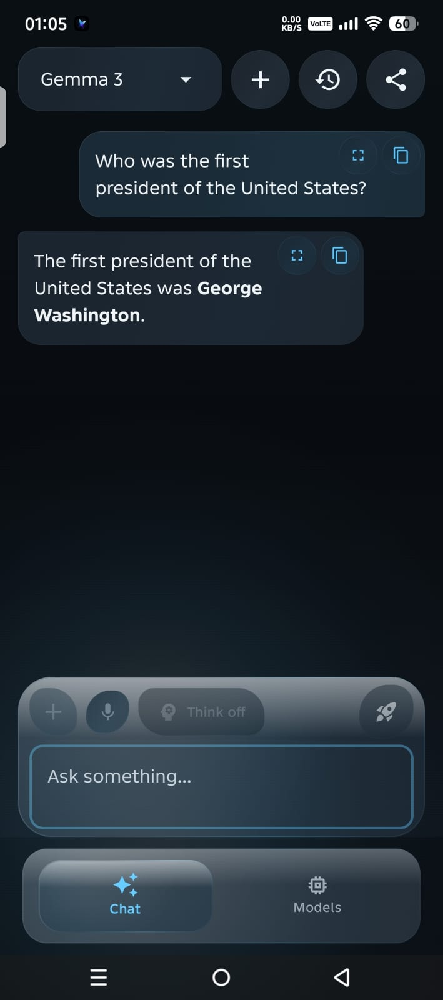
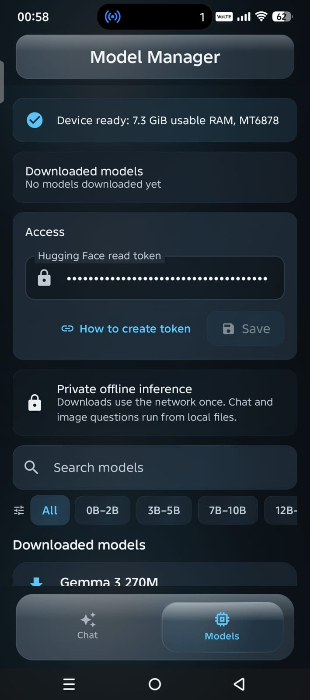
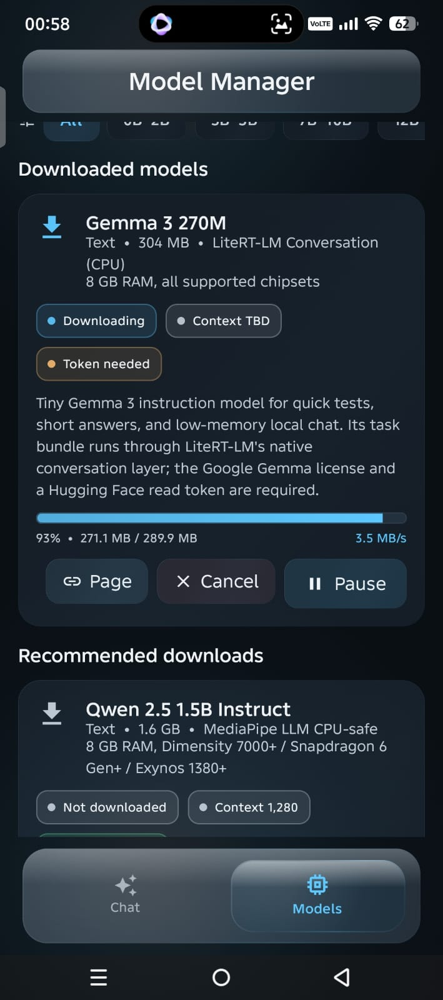

<div align="center">


# Solus

### Private, local AI — running entirely on your Android device.

Chat, reason, code, and analyze documents offline with complete privacy.  
Your conversations never leave your phone.

<br/>

<!-- Custom glass-gradient download CTA (docs/assets/download-solus-apk.svg) -->
<p>
  <a href="https://github.com/ShounakPatra/Solus/releases/download/v1.2.0/app-release.apk" title="Download the latest Solus APK">
    
  </a>
</p>

<p>
  <sub>Tap the button to get the newest release · Android 8.0+</sub>
</p>

<p>
  <a href="https://github.com/ShounakPatra/Solus/releases">
    
  </a>
  
  
  
</p>

<p>
  
  
  
  
  
</p>

**🔒 100% Offline &nbsp;•&nbsp; 💳 No Subscriptions &nbsp;•&nbsp; 🚀 On-Device Speed &nbsp;•&nbsp; ✨ Glass UI**

</div>

---

## 📱 App Preview

<p align="center">
  
  &nbsp;&nbsp;
  
  &nbsp;&nbsp;
  
</p>

<p align="center">
  <sub><b>Private chat</b> · <b>Model manager</b> · <b>Resumable downloads</b></sub>
</p>

---

## ✨ Features

<div align="center">

| | Capability |
|---|---|
| 💬 | **Local multi-turn chat** — inference on-device via CPU / GPU |
| 🧠 | **Thinking mode** — full control for reasoning models (e.g. DeepSeek R1-style) |
| 🖼️ | **Vision & documents** — images, camera, files, and rich document chat |
| 📐 | **Math rendering** — native LaTeX, scrollable formulas, copy & selection |
| ⏬ | **High-tech download dashboard** — live speed (MB/s), size progress, dynamic ETA, glow accents |
| ⚙️ | **Full-screen customization** — toggle themes, telemetry, auto-hide nav, timers, personas |
| 🎨 | **Dynamic model accent themes** — DeepSeek (Cyan), Gemma (Amber), Qwen (Violet), Llama (Emerald) |
| 📱 | **Auto-hide bottom navigation** — full-screen chat with left/right tab swipe gesture navigation |
| 📊 | **Telemetry & thermal guard** — real-time t/s, TTFT latency, battery temp (°C), available RAM |
| ⚡ | **Solus Bench rating** — on-card benchmark rating dialog showing device speed ratings & profiles |
| 🎯 | **System prompt personas** — General, Code Auditor, Simple ELI5, Proofreader, Translator |
| ✨ | **Glassmorphism UI** — Compose + Haze blur, fluid tab motion & dark glass controls |

</div>

---

## 🆕 What’s new in **v1.5.0**

- **Full-Screen Settings & Customization** — Comprehensive customization menu with solid opaque background and glassmorphic category cards for themes, telemetry, layout, timers, and tokens.
- **Dynamic Model Accent Themes** — Instant reactive theme accent colors adapting automatically to DeepSeek (Cyan), Gemma (Amber), Qwen (Violet), and Llama (Emerald).
- **Auto-Hide Bottom Navigation** — Toggleable auto-hide bottom bar mode for full-screen chat, seamlessly paired with left/right horizontal swipe tab navigation.
- **High-Tech Downloading Model Cards** — Resumable downloads equipped with live speed (`⚡ MB/s`), percentage, downloaded vs total size (`MB/GB`), dynamic ETA countdown (`⏱️ ETA: 1m 45s`), and family accent glowing borders.
- **Inference Telemetry & Thermal Guard** — Sleek single-line scrollable telemetry bar providing real-time speed (`t/s`), TTFT latency (`ms`), backend engine, battery temperature (`°C`), and available RAM (`GB free`).
- **Solus Bench Performance Rating** — On-card device benchmark rating dialog showing model performance profiles and expected token speeds.
- **System Prompt Personas** — Quick prompt presets with automatic chat input clearing when switching back to General.
- **Circular Dark Glass Controls** — Custom dark glass back button styling in Settings.
- **Hugging Face Token Manager** — Token management integrated directly into Settings with a direct link to the token creation video guide.

---

## 🛠️ Built With

<div align="center">

| Layer | Stack |
|---|---|
| Language | **Kotlin 2.3.0** |
| UI | **Jetpack Compose**, Material 3, Haze glass blur |
| Inference | **LiteRT** (TensorFlow Lite), **MediaPipe GenAI**, **llama.cpp JNI** |
| Math | `com.hrm.latex` |
| Local state | **SharedPreferences** (chat history, app settings, download state) |

</div>

---

## 📊 Solus vs Google AI Edge Gallery

Both run generative AI on-device. Solus focuses on a polished private Android assistant with documents, guided models, custom settings, and reliable downloads.

<div align="center">

| Feature | Solus | Google AI Edge Gallery |
|---|:---:|:---:|
| Fully offline inference | ✅ | ✅ |
| Open source | ✅ | ✅ |
| Free | ✅ | ✅ |
| Local conversation history | ✅ | ✅ |
| Vision models | ✅ | ✅ |
| Document chat (PDF, DOCX, PPTX, XLSX, …) | ✅ | ❌ |
| Custom Settings & Themes | ✅ | ❌ |
| Auto-hide bottom navigation & swipe tabs | ✅ | ❌ |
| Resumable download manager with live ETA | ✅ | ✅ |
| Device-aware model recommendations & bench ratings | ✅ | ❌ |
| Response cleanup (control tokens / thinking tags) | ✅ | ❌ |
| Real-time thermal & RAM telemetry guard | ✅ | ❌ |

</div>

---

## 🎯 Model Compatibility Guide

<div align="center">

| Need | Starting point | Size | Gated |
|---|---|:---:|:---:|
| Everyday chat & summaries | Qwen 2.5 Instruct / Gemma 3 | ~1.5–3 GB | No / Yes |
| Kotlin, Python, coding | Qwen 2.5 Coder | ~2.2 GB | No |
| Math, planning, reasoning | DeepSeek R1 Distill / Qwen 3 | ~1.8 GB | No |
| Images & visual Q&A | Gemma 3n Vision / FastVLM | ~2.5 GB | Yes |
| Low RAM / quick test | Qwen 2.5 0.5B / TinyLlama | ~400 MB | No |

</div>

> Tip: use the **Models** tab filters and device cards — Solus highlights what fits your phone.

---

## 📂 Project Structure

```text
Solus
├── app/
│   ├── src/main/java/com/shounak/localmeshai/
│   │   ├── ai/                 # Inference managers & runtimes
│   │   ├── models/             # Model catalog & info
│   │   ├── ui/
│   │   │   ├── components/     # Math cards, telemetry, preset bars, shared UI
│   │   │   ├── screens/        # Chat, Models, Settings, Image flows
│   │   │   ├── theme/          # Colors, typography, glass theme, model accent themes
│   │   │   └── viewmodels/     # Chat, Vision, Main
│   │   ├── utils/              # AppSettings, Glass effects, sanitizers, downloads
│   │   └── MainActivity.kt
│   └── build.gradle.kts
├── docs/screenshots/
├── gradle/libs.versions.toml
└── README.md
```

---

## 📥 Installation

<p align="center">
  <a href="https://github.com/ShounakPatra/Solus/releases/download/v1.2.0/app-release.apk" title="Download the latest Solus APK">
    
  </a>
</p>

1. Tap the **Download Solus APK** button (or open **[Releases](https://github.com/ShounakPatra/Solus/releases)**).
2. Download **`release.apk`** for **v1.5.0**.
3. Install on your phone (allow *Install unknown apps* if prompted).
4. Open Solus → **Models** → download a compatible model → start chatting.

**Requirements:** Android **8.0+** (API 26), **ARM64** device recommended for on-device models.

---

## 🏗️ Build from Source

**Requirements:** Android Studio (Ladybug or newer) · Android SDK **36** · **JDK 17**

```bash
git clone https://github.com/ShounakPatra/Solus.git
cd Solus

# Debug APK
./gradlew assembleDebug

# Unit tests
./gradlew testDebugUnitTest
```

Debug APK path: `app/build/outputs/apk/debug/app-debug.apk`

---

## 🔐 Privacy by Design

- Inference runs **only on-device** (CPU / GPU) after models are downloaded.
- Chat history stays in **local app storage** (not a cloud backend).
- Network access is for **model downloads** and optional links — not for chatting.
- Hugging Face tokens (for gated models) are stored **only on the device**.

---

## 💡 FAQ

<details>
<summary><b>Does Solus run fully offline?</b></summary>
<br/>

Yes. After a model is downloaded you can turn off Wi‑Fi and mobile data. Chat and history stay local.

</details>

<details>
<summary><b>Why is the APK relatively large (~200MB)?</b></summary>
<br/>

Native runtimes (MediaPipe, LiteRT, llama.cpp JNI) and architecture-specific libraries ship in the APK so inference is fast out of the box.

</details>

<details>
<summary><b>Can I load arbitrary GGUF / ONNX files?</b></summary>
<br/>

Current runtimes support optimized Android formats (`.task`, `.litertlm`). Custom GGUF support via llama.cpp JNI is actively expanded.

</details>

<details>
<summary><b>How do I access gated models like Gemma 3?</b></summary>
<br/>

Enter your Hugging Face read token inside **Settings** → **Hugging Face Access Token**. Use the "How to create token" button for a quick video tutorial.

</details>

---

## 🗺️ Roadmap

<div align="center">

| Version | Status | Highlights |
|---|:---:|---|
| **v1.0.0** | ✅ Shipped | Core local chat, model manager, glass UI foundation |
| **v1.1.0** | ✅ Shipped | Thinking controls, resumable downloads, device checks, UI polish |
| **v1.2.0** | ✅ Shipped | Tab motion, Haze scroll FABs, FAB docking, deferred history load |
| **v1.5.0** | ✅ **Current** | Full settings menu, dynamic themes, auto-hide nav, high-tech downloading cards, telemetry guard, personas |
| **v2.0.0** | 🔬 Research | On-device speech (Whisper-class), local GGUF conversion helpers, encrypted exports |

</div>

---

## 👤 Author

**Shounak Patra**  
GitHub: [@ShounakPatra](https://github.com/ShounakPatra)

---

## 📄 License

Solus is licensed under the **Apache License 2.0**. See [LICENSE](LICENSE) for details.

---

<div align="center">

**Made for private, on-device AI.**

<p>
  <a href="https://github.com/ShounakPatra/Solus/releases/download/v1.2.0/app-release.apk" title="Download the latest Solus APK">
    
  </a>
</p>

[★ Star on GitHub](https://github.com/ShounakPatra/Solus)

</div>
