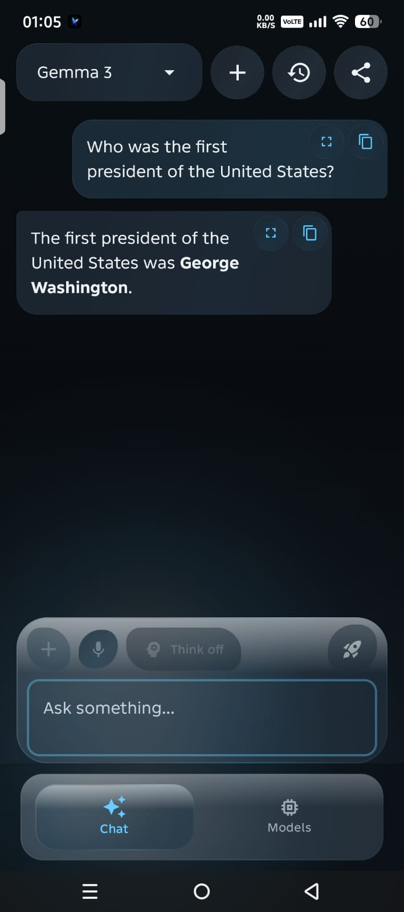
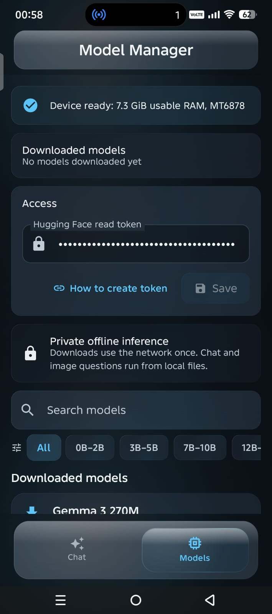
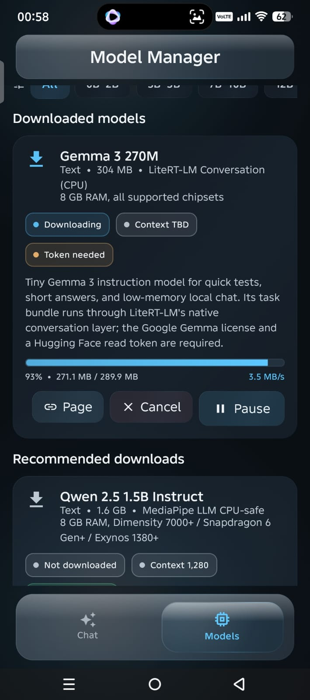
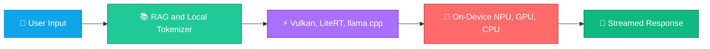

<div align="center">


# Solus

### Private, local AI — running entirely on your Android device.

Chat, reason, code, listen, and query documents offline with complete privacy.  
Your conversations and files never leave your phone.

<br/>

<!-- Custom glass-gradient download CTA (docs/assets/download-solus-apk.svg) -->
<p>
  <a href="https://github.com/ShounakPatra/Solus/releases/download/v3.0.0/app-release.apk" title="Download the latest Solus APK">
    
  </a>
</p>

<p>
  <sub>Tap the button to get the newest release · Android 8.0+</sub>
</p>

<p>
  
  
  
  
</p>

<p>
  
  
  
  
  
</p>

<p align="center">
  <a href="https://trendshift.io/repositories/156746" target="_blank" rel="noopener noreferrer">
    
  </a>
</p>

**🔒 100% Offline &nbsp;•&nbsp; ⚡ Vulkan GPU &nbsp;•&nbsp; 📚 Local RAG &nbsp;•&nbsp; 🎙️ Audio Input &nbsp;•&nbsp; 🧩 GGUF Support**

</div>

---

## 📱 App Preview

<p align="center">
  
  &nbsp;&nbsp;
  
  &nbsp;&nbsp;
  
</p>

<p align="center">
  <sub><b>Private chat</b> · <b>Model manager</b> · <b>Resumable downloads</b></sub>
</p>

---

## ✨ Key Capabilities

<div align="center">

| | Capability | Description |
|---|---|---|
| ⚡ | **Vulkan GPU Acceleration** | Native Vulkan graphics compute backend integrated via `llama.cpp JNI` for accelerated inference on modern mobile GPUs |
| 📚 | **On-Device RAG Engine** | Retrieval-Augmented Generation with local chunking, vector embeddings, similarity matching, and cross-session document continuity |
| 🧩 | **GGUF Model Execution** | Experimental direct GGUF inference (e.g. Qwen 2.5 0.5B GGUF; note: Llama 3.2 1B GGUF not yet supported; full GGUF suite coming in October) |
| 🎙️ | **Full Voice & Audio Input** | 16kHz PCM audio recording with pause/resume controls, live waveform meters, pre-send audio player, and in-bubble playback |
| 🔄 | **In-App Auto Updater** | Automatic checking, downloading, and package installation of new Solus APK releases directly from GitHub Releases |
| 🖼️ | **Vision & Document Analysis** | Multimodal image understanding, PDF page rendering, camera capture, and color-coded document badge viewers |
| 📂 | **External Document Viewers** | One-tap launch to open attached PDFs, images, code files, and office docs in default device viewer apps |
| 💬 | **Local Multi-Turn Chat** | Offline inference on-device with zero network latency, persistent conversations, and complete telemetry |
| 🧠 | **Thinking & Reasoning Mode** | Native reasoning capture for DeepSeek R1-style models with expandable thinking disclosure blocks |
| 📐 | **Math Formula Rendering** | LaTeX parsing, display math blocks, inline KaTeX formatting, and selectable formula copy |
| ⏬ | **High-Tech Download Manager** | Live speed (`MB/s`), size progress (`MB/GB`), dynamic ETA countdown (`⏱️ ETA`), and family glowing accents |
| ⚙️ | **Full-Screen Customization** | Comprehensive Settings screen with theme accent pickers, telemetry toggles, and Hugging Face token manager |
| 🎨 | **Dynamic Model Themes** | Reactive UI accents adapting to DeepSeek (Cyan), Gemma (Amber), Qwen (Violet), and Llama (Emerald) |
| 📱 | **Fluid Liquid Glass UI** | Compose + Haze real-time glassmorphism blur, spring animations, and gesture-driven navigation |

</div>

---

## 🆕 What’s New in **v3.0.0**

- **🚀 16 KB Page-Size Compliance (Android 15+)** — Full native compliance for Android 15/16 devices with 16 KB memory pages. Completely eliminated legacy 4 KB-aligned runtimes; all native libraries (`llama.cpp`, `LiteRT-LM`, `MediaPipe`) are strictly 16 KB / 64 KB aligned.
- **📉 81% APK Footprint Reduction (244 MB → 46 MB)** — Massive size optimization by stripping 73 MB of emulator `x86_64` junk, enabling native library compression (`useLegacyPackaging = true`), and enabling R8 minification and resource shrinking into a single 7.2 MB `classes.dex`.
- **🛡️ Pure Offline Zero-Telemetry Hardening** — Completely purged legacy Firebase Crashlytics, installation tracking, and Play Services measurement connectors. Solus is 100% private with its own on-device `CrashReportManager` and zero network telemetry.
- **🧠 Universal Persistent Memory for Vision & Text** — Enabled full persistent memory capabilities across multimodal vision models (previously limited to text models) with cross-session memory preservation.
- **🎯 Contextual Query-Aware Memory Recall** — Added keyword and semantic intent filtering to prevent stored memories from intruding into casual greetings or unrelated questions; memories now recall only when genuinely contextually relevant.
- **💭 Strict Thinking Mode Controls** — Completely resolved persistent `<think>` reasoning blocks appearing when Thinking Mode is turned off; added multi-layer tag normalization and unclosed block sanitization across both text and multimodal pipelines.
- **🔄 Response Diversity & Prompt Hygiene** — Fixed repetitive model answers across distinct prompts with improved temperature calibration, sampling parameter freshness, and stream deduplication.
- **⚡ 10x Faster Build Pipelines** — Enabled Gradle Configuration Cache, Build Cache, and Parallel execution in `gradle.properties` for near-instant build and test execution.

---

## 🛠️ Built With

<div align="center">

| Layer | Stack |
|---|---|
| Language | **Kotlin 2.3.0** & **C++20** |
| UI Framework | **Jetpack Compose**, Material 3, Haze Glass Blur |
| Inference Backends | **llama.cpp JNI (CPU + Vulkan)**, **LiteRT** (TensorFlow Lite), **MediaPipe GenAI** |
| Retrieval (RAG) | Local Vector Embeddings, Cosine Similarity, In-Memory Index |
| Math Engine | `com.hrm.latex` |
| Media & Audio | Android `AudioRecord` (16kHz PCM16 Mono), `MediaPlayer`, `PdfRenderer` |
| Local State | **SharedPreferences** & Private File Storage |

</div>

---

## 📊 Solus vs Other On-Device Runners

<div align="center">

| Feature | Solus | Generic On-Device Apps |
|---|:---:|:---:|
| 100% Fully Offline Inference | ✅ | ✅ |
| Open Source (Apache 2.0) | ✅ | Varies |
| Vulkan GPU Acceleration | ✅ | ❌ |
| Local Document RAG (Embeddings) | ✅ | ❌ |
| Direct GGUF Model Support | ✅ *(Expanding Oct)* | ❌ |
| Voice Recording & In-Bubble Audio | ✅ | ❌ |
| External App Document Viewer | ✅ | ❌ |
| In-App GitHub OTA Auto-Updater | ✅ | ❌ |
| Dynamic Family Accent Themes | ✅ | ❌ |
| Real-Time Thermal & RAM Telemetry | ✅ | ❌ |
| Resumable Download Manager with Live ETA | ✅ | ❌ |

</div>

---

## 🎯 Model Compatibility Guide

<div align="center">

| Purpose | Model | Format | Recommended RAM | Backend |
|---|---|:---:|:---:|:---:|
| Quick test / Low RAM | **Qwen 2.5 0.5B GGUF** | `.gguf` | 3–4 GB | llama.cpp / Vulkan |
| Everyday chat & reasoning | **Qwen 2.5 1.5B Instruct** | `.task` / `.litertlm` | 4–6 GB | LiteRT / MediaPipe |
| Coding & Technical tasks | **Qwen 2.5 Coder 1.5B** | `.task` / `.litertlm` | 4–6 GB | LiteRT / MediaPipe |
| Deep reasoning & Math | **DeepSeek R1 Distill Qwen 1.5B** | `.task` / `.litertlm` | 4–6 GB | LiteRT / MediaPipe |
| Vision & Multimodal Q&A | **Gemma 3n Vision / FastVLM** | `.task` | 6–8 GB | MediaPipe Vision |
| Balanced general assistant | **Gemma 3 1B / 4B** | `.task` | 6–8 GB | MediaPipe |

</div>

> 💡 **Notice on GGUF Support**: Solus v2.0.0 introduces native GGUF support for selected architectures such as Qwen 2.5 0.5B. Certain models like Llama 3.2 1B GGUF are currently unsupported. Comprehensive GGUF compatibility, full architecture support, and dedicated optimizations are arriving in our major **October update**!

---

## 📂 Project Structure

```text
Solus
├── app/
│   ├── src/main/
│   │   ├── cpp/                # llama.cpp native submodule & JNI bridge (CPU + Vulkan)
│   │   ├── java/com/shounak/localmeshai/
│   │   │   ├── ai/             # Inference managers (Chat, Vision, llama.cpp JNI)
│   │   │   ├── models/         # Model catalog, downloaders & ratings
│   │   │   ├── rag/            # Local RAG vector store, chunking & retrieval
│   │   │   ├── ui/             # Compose screens, components, theme & viewmodels
│   │   │   └── utils/          # AppUpdateManager, AudioUtils, AttachmentViewer, Glass
│   │   └── res/                # XML layouts, file providers, icons, mipmaps
│   └── build.gradle.kts
├── gradle/libs.versions.toml
└── README.md
```

---

## 📥 Installation

<p align="center">
  <a href="https://github.com/ShounakPatra/Solus/releases/download/v3.0.0/app-release.apk" title="Download the latest Solus APK">
    
  </a>
</p>

1. Tap the **Download Solus APK** button above or open [Releases](https://github.com/ShounakPatra/Solus/releases).
2. Download **`app-release.apk`** for **v3.0.0**.
3. Install the APK on your device (allow *Install unknown apps* if prompted).
4. Launch Solus → open **Models** → download your preferred model → begin private chatting!

> **Requirements**: Android 8.0+ (API 28+ recommended), ARM64-v8a device.

---

## 🏗️ On-Device Architecture Pipeline

Solus processes all text, vision, audio, and documents 100% locally on your phone without sending any data to external servers:


```mermaid
flowchart LR
    A["📱 User Input"] --> B["📚 RAG and Local Tokenizer"]
    B --> C["⚡ Vulkan, LiteRT, llama.cpp"]
    C --> D["🧠 On-Device NPU, GPU, CPU"]
    D --> E["💬 Streamed Response"]

    style A fill:#0EA5E9,stroke:#0284C7,color:#ffffff
    style B fill:#20C997,stroke:#0F766E,color:#ffffff
    style C fill:#A970FF,stroke:#7E22CE,color:#ffffff
    style D fill:#FF6B6B,stroke:#C53030,color:#ffffff
    style E fill:#10B981,stroke:#047857,color:#ffffff
```
<p align="center">
  <sub><b>Supported Inputs:</b> Text prompts · Microphone audio · Camera & images · Local documents (PDF, DOCX, TXT)</sub>
</p>

---

## 🛠️ Build from Source

**Requirements**: Android Studio (Ladybug or newer) · Android SDK 37 (Android 17) · NDK (r26+ with CMake) · JDK 17

```bash
git clone https://github.com/ShounakPatra/Solus.git
cd Solus

# Build debug APK
./gradlew assembleDebug

# Run all unit tests
./gradlew testDebugUnitTest

# Build signed release APK
./gradlew assembleRelease
```

Release APK path: `app/build/outputs/apk/release/app-release.apk`  
Debug APK path: `app/build/outputs/apk/debug/app-debug.apk`

---

## 🔐 Privacy & Security Architecture

Solus is engineered from inception with strict **Privacy by Design**:

- **100% Offline Execution:** After downloading model weights, Wi-Fi and cellular data can be turned off entirely.
- **Zero Network Telemetry:** No analytics, no tracking, and no external API requests during inference.
- **Sandboxed Storage:** Chat sessions, RAG vectors, and attachments remain strictly isolated inside internal app storage.
- **Secure Hugging Face Auth:** API tokens are stored securely in local device preferences and only transmitted directly to official Hugging Face CDN endpoints during gated model downloads.
- **Native Crash Guard:** `InitCrashGuard` prevents infinite crash loops by monitoring native initialization integrity.

---

## 💡 FAQ

<details>
<summary><b>Does Solus run fully offline?</b></summary>
<br/>

Yes! Once a model is downloaded to your device, you can completely turn off Wi-Fi and mobile data. All chat inference, document querying, and audio processing occur 100% locally.

</details>

<details>
<summary><b>How does local Document RAG work?</b></summary>
<br/>

When you attach a file (PDF, TXT, DOCX, etc.), Solus splits the document into text chunks and generates on-device embeddings. When you ask a question, Solus performs cosine similarity matching to inject relevant document chunks directly into the model's context window.

</details>

<details>
<summary><b>Which GGUF models are currently supported?</b></summary>
<br/>

Solus v2.0.0 features experimental GGUF execution for lightweight architectures such as Qwen 2.5 0.5B GGUF. Some architectures like Llama 3.2 1B GGUF are not yet supported. Full GGUF compatibility across major model families is arriving in October!

</details>

<details>
<summary><b>How does the in-app updater work?</b></summary>
<br/>

Solus periodically checks the official GitHub repository releases API. When a new version is detected, you receive an in-app prompt with changelog details and can download and install the new APK directly.

</details>

<details>
<summary><b>How do I access gated models like Gemma 3?</b></summary>
<br/>

Go to **Settings** → **Hugging Face Access Token** and enter your read token. You can use the built-in video tutorial guide button for assistance in generating one.

</details>

---

## 🗺️ Roadmap

<div align="center">

| Version | Status | Highlights |
|---|:---:|---|
| **v1.0.0 – v1.2.0** | ✅ Shipped | Core local chat, thinking controls, resumable downloads, directional tab motion |
| **v1.5.0** | ✅ Shipped | Full Settings menu, dynamic model themes, auto-hide nav, high-tech downloading cards, telemetry guard |
| **v2.0.0** | ✅ Shipped | **Vulkan GPU compute**, **Local RAG document search**, **Audio & Voice input**, **In-App GitHub Auto-Updater** |
| **v3.0.0** | ✅ **Current** | **16 KB page-size compliance (Android 15+)**, **Optimized 46 MB footprint**, **Zero telemetry/analytics**, **Compressed ARM64 native runtime**, **Full GGUF model support** |

</div>

---

## 👤 Author

**Shounak Patra**  
GitHub: [@ShounakPatra](https://github.com/ShounakPatra)

---

## 📄 License

Solus is licensed under the **Apache License 2.0**. See [LICENSE](LICENSE) for details.

---

<div align="center">

**Made for private, on-device AI.**

<p>
  <a href="https://github.com/ShounakPatra/Solus/releases/download/v3.0.0/app-release.apk" title="Download the latest Solus APK">
    
  </a>
</p>

[★ Star on GitHub](https://github.com/ShounakPatra/Solus)

</div>
