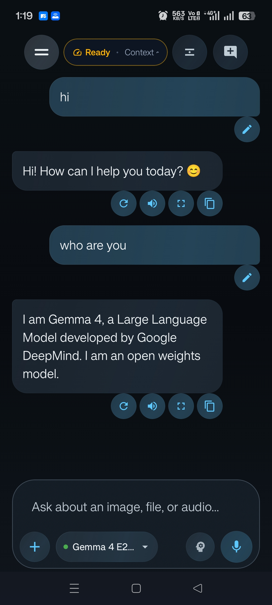
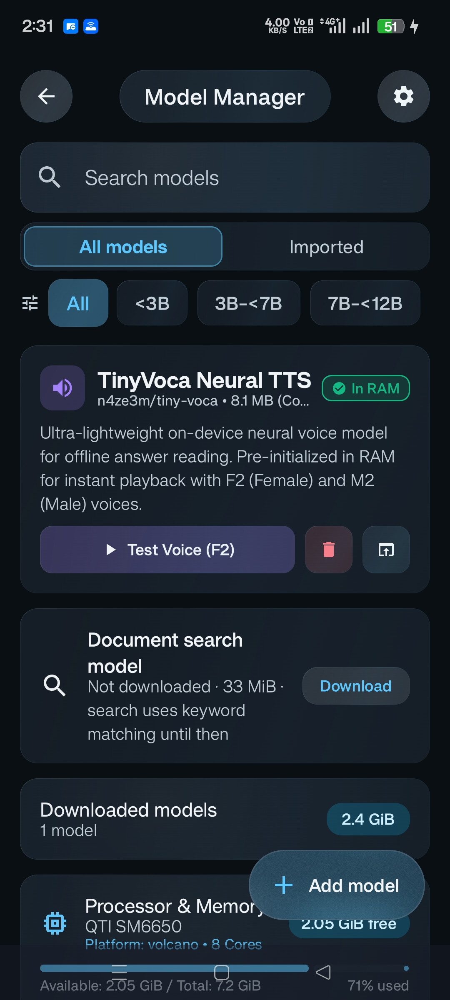
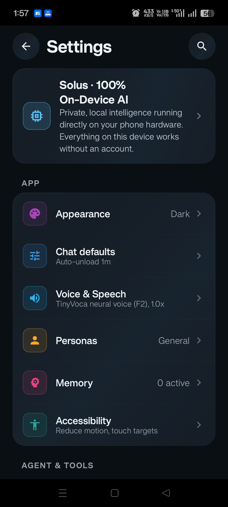

<div align="center">


# Solus

### Your models. Your conversations. Your device.

**Private chats · Multiple model formats · Document assistance**

**v7.0.0 · Android 11+ · ARM64-v8a**

<p>
  <a href="https://github.com/ShounakPatra/Solus/releases/download/v7.0.0/app-release.apk" title="Download Solus v7.0.0 from GitHub">
    
  </a>
  &nbsp;
  <a href="https://fdroid.link/#https://shounakpatra.github.io/Solus/fdroid/repo?fingerprint=F025EBCC623B3B0DD55F0B1CF65BA228CDB758272F00234CAD114E4C4F0695CC" title="Install or update Solus via its F-Droid repository">
    
  </a>
</p>


<sub>Get v7.0.0 from <a href="https://github.com/ShounakPatra/Solus/releases/download/v7.0.0/app-release.apk">GitHub Releases</a> or install via the <a href="https://fdroid.link/#https://shounakpatra.github.io/Solus/fdroid/repo?fingerprint=F025EBCC623B3B0DD55F0B1CF65BA228CDB758272F00234CAD114E4C4F0695CC">Solus F-Droid repository</a> (<code>https://shounakpatra.github.io/Solus/fdroid/repo</code>). Both distribute the same maintainer-signed APK; an <a href="https://gitlab.com/fdroid/rfp/-/work_items/4686">official F-Droid RFP</a> is also pending.</sub>

[](https://github.com/ShounakPatra/Solus/actions/workflows/android-ci.yml)


[](https://github.com/ShounakPatra/Solus/releases)

<sub>Downloads count all assets on existing GitHub releases; third-party F-Droid downloads and deleted releases are not included.</sub>

[Get started](#get-started) · [Features](#made-for-your-own-models) · [Compare apps](#compare-apps) · [Model compatibility](#model-compatibility) · [Build from source](#build-from-source)

</div>

> [!IMPORTANT]
> Models are downloaded separately. Choose a compatible model that fits your device's available storage and memory; supported features depend on the model and its export.

---

## App preview

<p align="center">
  
  &nbsp;
  
  &nbsp;
  
</p>

<p align="center"><sub>Chat with Gemma 4, manage models and TinyVoca TTS, and search 74+ settings in the Liquid Glass workspace.</sub></p>

## Get started

1. **Install** via the [Solus F-Droid repository](https://fdroid.link/#https://shounakpatra.github.io/Solus/fdroid/repo?fingerprint=F025EBCC623B3B0DD55F0B1CF65BA228CDB758272F00234CAD114E4C4F0695CC) ([repo URL](https://shounakpatra.github.io/Solus/fdroid/repo/)) or download the [v7.0.0 signed APK](https://github.com/ShounakPatra/Solus/releases/download/v7.0.0/app-release.apk). It requires **Android 11+** and an **ARM64-v8a** device. Verify it with the [matching SHA-256 checksum](https://github.com/ShounakPatra/Solus/releases/download/v7.0.0/app-release.apk.sha256).
2. **Choose a model** in **Models**, or use **Add model** to import one from your phone, Hugging Face or a direct URL.
3. **Start a chat** after the model finishes loading. A small model is a good place to start if your phone has limited RAM.
4. **Add context** with a PDF or DOCX. Image and audio inputs require a compatible model and export.

An existing installation can be updated without uninstalling when Android accepts the package and signing identity. Back up important chats first. Model weights need additional storage and are not included in workspace backups.

## What's new in v7.0.0

Solus v7.0.0 is a landmark release—featuring a **Rust + Candle native core rebuild**, **bundled on-device neural voice reading**, and a **full Liquid Glass UI overhaul**:

- **Rebuilt with Rust & Candle (`solus_candle`):** Core portable inference, tensor computation, tokenizer execution, and panic-guarded JNI bindings are built in Rust (`candle-core` 0.9.1) for memory safety, predictable CPU multi-threading, and minimal battery overhead.
- **TinyVoca Neural Voice (TTS) & Live Word Highlighting:** Ultra-compact 8.1 MB `tiny_voca.onnx` neural voice bundled in the APK for instant zero-network reading aloud with F2/M2 voices, syllable-aware live word highlighting, and one-tap asset restoration.
- **Liquid Glass Workspace & Live Aurora:** Full-bleed edge-to-edge layout (removing the legacy bottom navigation bar, making system navigation transparent on Android, and scoping an opaque status bar with pinned search to the Model Manager), frosted glass sliders, animated `LiveAuroraBackground`, and the Vice City neon sunset launcher emblem (with original icon backup).
- **19-Submenu Ranked Settings Search (`SettingsSearchIndex`):** Indexes 74+ settings plus user model profiles with multi-token relevance scoring, deep-linking, and a dedicated **Personas** submenu.
- **Unified Passive Template-Native Thinking:** Replaced legacy per-model thinking heuristics and prompt injections with passive `enable_thinking` forwarding across GGUF, LiteRT-LM **0.19.1**, ONNX, and Candle, permanently active thought-block parsing (`<think>`, `<|channel>thought`, `<|thought|>`), unclosed-tag recovery, and clean **Gemma 3 270M** `.task` routing.
- **Tool-Free Web Search, Telemetry & Crash Diagnostics:** Autonomous web search with a Glass UI search test viewer, device RAM/storage breakdown cards (`potion-base-2M`, TinyVoca, caches), formal lifecycle state machines, and redesigned Crash Reports with single-report deletion and Liquid Glass **Send to Repo** actions.

The release retains expanded model imports, conversation tools, optional neural document search, history search and pinning, temporary chats, backups, per-model profiles and the glass interface.

Read the release notes on [GitHub Releases](https://github.com/ShounakPatra/Solus/releases). Available features and performance depend on the model export, runtime and device; not every model supports every input or tool.

## Made for your own models

Use the workspace for a quick question or build a longer conversation around your own files.

| | What you can do |
| --- | --- |
| 💬 **Chat, write and code** | Local generation, formatted code and math, personas, prompt editing and regeneration |
| 📚 **Ask about documents** | PDF, DOCX, text and code extraction; chat-scoped context and original-file previews |
| 🎙️ **Use images and audio** | Camera, photos, audio files and microphone input with compatible models |
| 🛠️ **Give models tools** | Built-in and custom skills, with collapsible **Used tool** records |
| 🗂️ **Keep your workspace** | Search and pin history, temporary chats, saved memories and per-model profiles |
| 💾 **Back up and restore** | Move chats, memories, settings and available attachments between installations |
| 📦 **Manage model files** | Catalog and Hugging Face downloads, companion bundles, imports and relinking |
| ⚙️ **Tune your experience** | Compatible CPU/GPU options, optional warm-up, performance telemetry and glass controls |

## Compare apps

These projects have different goals. The table summarizes their publicly documented
features; **Not verified** means the linked documentation did not establish the
answer, not that the feature is absent. Model, version and device support vary.

| Feature | Solus v7.0.0 | AI Edge Gallery | PocketPal AI | AnythingLLM Mobile | MLC Chat |
| --- | --- | --- | --- | --- | --- |
| Native runtimes | **Multi-runtime:** `llama.cpp` (CPU/Vulkan), Rust `Candle` (`solus_candle`), LiteRT-LM 0.19.1, MediaPipe & ONNX Runtime 1.31.1 | LiteRT / LiteRT-LM | `llama.cpp` (CPU, OpenCL/Adreno & NPU) | `llama.rn` (`llama.cpp` CPU) + optional Desktop/Cloud sync | MLC / TVM OpenCL GPU engine |
| Local model formats | **6 formats:** `.gguf`, `.litertlm`, `.task`, `.onnx`, `.safetensors`, `.tflite` | LiteRT / `.litertlm` / `.tflite` | GGUF | GGUF | Compiled MLC packages only (requires TVM conversion; no raw GGUF/SafeTensors) |
| Offline Neural Voice (TTS) | **Bundled 8.1 MB `TinyVoca` ONNX TTS + synchronized live word highlighting** (plus mic/audio input) | Audio Scribe (STT); bundled neural TTS not verified | Whisper STT + TTS (Kokoro / system); hands-free voice requires **Plus** on Google Play | System assistant / voice input documented; bundled neural TTS not verified | Not documented (text chat focused) |
| Images, audio & document Q&A | **Vision, audio & offline PDF/DOCX RAG (`potion-base-2M`) with collapsible Sources passages** | Ask Image, Audio Scribe & media search; general PDF/DOCX Q&A not verified | Vision & voice documented; PDF/DOCX RAG not verified in README | Offline vision & local RAG (PDF, Word, Excel, txt); passage UI details not verified | Primarily text-to-text chat on Android |
| Thinking & agent tools | **Passive template-native `enable_thinking` + always-on collapsible thought UI + tool-free autonomous web search & built-in skills** | Thinking Mode (Gemma) & Agent Skills (maps, Wikipedia) | Tool use (`calculator`, web search, Pals); thinking toggle not verified | Web search, calendar, doc generation & background jobs; template thinking toggle not verified | Not verified in Android docs |
| Temporary chats & backups | **Yes: isolated Temporary Chats + full workspace backup** (chats, memories & settings; excludes weights) | Not verified in README | Not verified in README | Workspace memory documented; temporary chats & backup format not verified | Not verified in README |
| UI & customization | **Liquid Glass + Live Aurora UI, 74+ ranked searchable settings (19 submenus) & per-model profiles** | Material showcase UI | Material UI with Pals & benchmarks | Workspace UI with RAM fit badges & Android assistant mode | Minimalist reference chat UI |
| Android requirement | **Android 11+ (API 30) · ARM64-v8a** | Android 12+ | Check project | Check project | Android 5.1+ (`minSdk 22`) |
| Pricing | **100% Free & Open Source (Apache 2.0) — every feature unlocked** | Free & Open Source | MIT (GitHub APK free; optional paid **PocketPal Plus** on Play/App Store) | MIT app free; optional managed **AnythingLLM Cloud** from USD 50/mo | Free & Open Source (Apache 2.0) |

Sources: [AI Edge Gallery](https://github.com/google-ai-edge/gallery),
[PocketPal AI](https://github.com/a-ghorbani/pocketpal-ai),
[AnythingLLM Mobile](https://github.com/Mintplex-Labs/anythingllm-mobile), and
[MLC LLM / MLC Chat](https://github.com/mlc-ai/mlc-llm). Features and pricing can change;
check each project's latest release before deciding.

## Tools and thinking

Enable **Tool calling** in Settings and select only the skills you need in **Manage tool skills**. Tool and document-search setting changes apply to the **next message in the current chat**.

Skills include calculator, date/time, document search, hashes, text statistics, unit conversion, random selection, QR codes, learning and adventure prompts, mood tracking, reminders, calendar actions, maps, Wikipedia and email drafts. Custom prompt skills can also be added.

Tools require compatible model behavior and templates. A plausible answer is not proof that a tool ran: check the **Used tool** record. Many enabled schemas consume context and can increase prompt-processing time; small models may ignore tool requests.

**Passive thinking and tool execution:** Think preferences (`enable_thinking`) are forwarded passively to model-native templates and LiteRT-LM conversations while the thought-block parser remains active for emitted reasoning chains—including supported LiteRT vision chats with tools enabled. A model need not return a separate reasoning block on every response.

Wikipedia uses the network. Calendar/email actions can open another app or a review screen, and external services may need connectivity. Review actions before completing them.

## Documents and sources

Attach a document using **+ → Files (RAG)**, or select a library document through **Knowledge Base**. Document context is scoped to the current chat's uploads and explicitly selected library documents; a new chat should not silently search another chat's uploads.

Solus can use extracted text directly or retrieve relevant passages. **Sources** identifies retrieved context, not independent verification of every claim. An answer using directly attached text does not necessarily have a Sources chip.

The optional **potion-base-2M** search model is approximately **7.5 MiB**, runs locally after download, and can be removed separately from your documents. Built-in local search is available without the neural model. Neural-model changes can require re-indexing.

Text-based PDF and DOCX files are supported. **Scanned/image-only PDFs require OCR first**; password protection, damaged archives, unsupported layouts or extraction limits can prevent useful text extraction.

## Model compatibility

| Format | Runtime / scope | Required assets |
| --- | --- | --- |
| `.gguf` | llama.cpp CPU or qualified Vulkan backend | Complete split set and compatible projector when required |
| `.litertlm` | LiteRT-LM **0.19.1** | A compatible packaged export; media/backend support is artifact-specific |
| `.task` | MediaPipe GenAI | A compatible packaged task model |
| `.onnx` | ONNX Runtime CPU; supported text and media tensor contracts | Configuration, processing/tokenizer files and any external data/component graphs |
| `.safetensors` | Candle CPU; implemented architecture adapters | Configuration, tokenizer/processor assets and all indexed shards/components |
| `.tflite` | TensorFlow Lite CPU; supported graph/task contracts | Supported embedded metadata or the export's required processing assets |

A **file extension is not a compatibility guarantee**. Recognizing a repository, filename or model family cannot supply a missing architecture adapter, custom operator, tokenizer or vision/audio pipeline.

- SafeTensors text adapters cover supported dense GPT-2, Qwen2/Qwen2.5, Llama, Mistral, original Gemma, Phi and Phi-3 layouts. Quantized checkpoints, MoE and other variants can require different adapters.
- Portable media paths include supported classification, transcription, original PaLiGemma/fused vision and SD1/SD2 diffusion contracts. These are experimental CPU paths, not support for arbitrary vision or audio checkpoints.
- Raw TFLite LLM exports with custom operations or unsupported external KV-cache interfaces may need the author's packaged `.task`/`.litertlm` version or a different runtime.
- SafeTensors loading can use FP32 memory substantially larger than the file's disk size. Diffusion and multimodal pipelines can be especially demanding.
- Importing or initializing successfully does not establish output quality, numerical correctness or acceptable performance.

See the [portable-model contract guide](docs/portable-models.md) and [llama.cpp integration notes](docs/llama-upstream.md) for detailed limits.

### Import methods

**Hugging Face / URL:** Paste a repository, folder or file link. HF imports resolve an immutable revision, select bundle companions and check compatibility before full weight downloads. **Save files only** stores files without claiming inference support.

**Phone files:** Select a complete model bundle. A `.zip` or `.solusmodel` archive can preserve component folders. ZIP packaging does not add support for the model inside it.

**Direct HTTP URLs:** Portable text exports need their configuration and tokenizer companions. Use a repository link or complete archive when metadata/components are in different folders.

Keep phone-imported originals accessible; use **Relink files** after moving them or changing storage permissions. Unlinking a storage import preserves original files; deleting an app-managed download removes that managed bundle.

## Privacy and offline use

Model inference and document retrieval run locally after required assets are available. Solus does not automatically upload conversations or crash reports.

Network operations include model/search-model downloads, update checks, Wikipedia and external services you choose to use. Maps and other Android intents may hand information to another app.

- Temporary chats skip saved conversation history and memory extraction.
- HF access tokens are encrypted using Android Keystore-backed storage and excluded from workspace backups.
- Backups can contain private chats, memories and documents. They exclude model weights, access tokens and document indexes; restore or re-index source documents when needed.
- Sharing a report, opening an external app or exporting a backup is a separate action. Review the destination and contents.

Read the [security policy](SECURITY.md) for storage, credentials and reporting details.

## Performance and recovery

Warm-up moves some one-time runtime work into model preparation. It can increase loading time and may be skipped on low-memory devices. A new conversation, long history, document context, tool schemas or media encoders can still make the next prompt expensive.

**Tune speed** and backend qualification are device/model-specific. Auto may select CPU when no qualifying GPU result exists. GPU availability does not guarantee correctness or a speed improvement.

Prompt timeouts and Stop controls help recover from stalled work while preserving runtime ownership until native execution unwinds. They do not guarantee an immediate stop for every native operation. Reduce enabled skills, context or model size if a phone remains slow.

## Build from source


The Android interface uses Kotlin, with C/C++ and Rust native runtimes, Python tooling,
and CMake/Shell build support. Bundled llama.cpp also contains GLSL Vulkan shaders;
its Svelte web interface and Apple Metal backend are upstream components.

Use the checked-in Gradle wrapper, a Gradle JVM supported by the configured Android Gradle Plugin, Android SDK **37**, NDK **28.2.13676358** and CMake **3.22.1**. Java/Kotlin bytecode targets Java 17. The wrapper is **Gradle 9.9.2**; the UI uses Kotlin **2.4.21**, Compose, Haze **1.7.3**, ONNX Runtime **1.31.1** and latexRenderer **1.8.0**.

Portable SafeTensors support also needs Rust and the `aarch64-linux-android` target. On Windows, [native tooling preparation](tools/prepare-native-tools.ps1) and the [Candle build helper](tools/build-candle.ps1) support the private ignored tool installations.

Build and run the checks with the Gradle wrapper:

```bash
git clone https://github.com/ShounakPatra/Solus.git
cd Solus
rustup target add aarch64-linux-android

./gradlew testDebugUnitTest
./gradlew lintDebug
./gradlew assembleDebug
```

On Windows, use `.\gradlew.bat`. Build parallelism can be adjusted to suit the available CPU and memory.

Keep `local.properties`, `keystore.properties`, signing keys, model weights and diagnostics out of commits. A local signed release needs your signing configuration:

```bash
./gradlew assembleRelease
```

APK locations are `app/build/outputs/apk/debug/` and `app/build/outputs/apk/release/`. Inspect generated output metadata for the actual filename.

### Validation and production releases

CI runs host native/Rust checks, unit tests, lint, instrumentation-test compilation, Android builds and APK packaging checks. **Compiling instrumentation tests does not run them on a phone.** Local tests and successful builds do not establish compatibility with every model.

Before publication, verify the exact signed APK's package/version, Android minimum, signing certificate, DEX/native packaging, upgrade behavior and device smoke tests. The [cloud release upload workflow](docs/release-artifact-upload.md) uses the approval-protected **release** environment and a successful matching CI run from `main`. A locally built release can also be signed with the existing key and uploaded after local tests, lint, APK integrity, certificate and checksum verification.

## Contributors & community

- [Report a reproducible issue](https://github.com/ShounakPatra/Solus/issues): include the app version/code, model file/revision, runtime, device, enabled tools and relevant redacted logs.
- [Contribute](CONTRIBUTING.md) · [Report a security issue privately](SECURITY.md).
- Maintainer: **Shounak Patra** · [GitHub](https://github.com/ShounakPatra) · [Email](mailto:shounakpatra68@gmail.com).

Solus is licensed under [Apache 2.0](LICENSE). Imported models and third-party runtimes retain their own licenses.
